# Covenant Layer

Open protocol and framework for shifting AI agent systems from **tool orchestration** to **outcome coordination**, with on-chain commitment infrastructure.

The central claim is that agents should not operate software step by step. They should coordinate commitments between participants who own fulfillment, stand behind results, and can prove what happened after acceptance.

<p align="center">
  
</p>

Old Model vs Covenant Model: [`docs/img/old-vs-new.svg`](docs/img/old-vs-new.svg)

In the current model, the agent calls tools, automates browsers, stitches workflows, and carries the full execution burden.

In the Covenant model, the agent publishes an objective, compares competing provider offers, accepts the best one under policy, and the provider fulfills the outcome in its own systems with evidence and settlement.

This is a fundamental change in interface design for the agent era. The public surface stops being a collection of procedures and becomes a market of explicit commitments.

---

## Overview

Covenant Layer introduces a new systems boundary for AI-native coordination.

Instead of exposing only low-level methods to agents and asking them to execute correctly across arbitrary APIs, UIs, and workflows, Covenant Layer moves the edge interaction to:

- objective publication
- offer discovery
- bounded authority
- explicit acceptance
- evidence-backed fulfillment
- recorded settlement

The result is a model that lets language systems stay close to intent, tradeoff analysis, policy, and approval, while deterministic execution remains with the providers that already own the operational stack.

This does not mean APIs disappear. APIs, internal systems, queues, and automation remain critical. The shift is that they move down the stack into provider-owned fulfillment instead of being the primary public interface exposed to agents.

---

## Why This Matters

Modern agent systems are still largely built around one assumption: the agent is a software operator.

That assumption works for demos and narrow tasks, but it becomes brittle in workflows that are delegated, multi-step, policy-heavy, and expensive to get wrong. In those environments, the hard problem is not just tool access. It is the gap between probabilistic reasoning and deterministic side effects.

Covenant Layer addresses that gap by changing where responsibility lives:

- the **agent** interprets intent, compares tradeoffs, applies policy, obtains approval, and monitors outcomes
- the **provider** performs exact fulfillment, produces evidence, and carries accountability for mismatch
- the **network** verifies identity, state, and settlement so that trust does not depend on one operator

That shift is what makes the model important. It is not simply better packaging for APIs. It is a higher-order coordination interface designed for the reality of agent-mediated work.

---

## Request To Settlement

<p align="center">
  
</p>

Request to Settlement Flow: [`docs/img/request-to-settlement.svg`](docs/img/request-to-settlement.svg)

The full lifecycle from user intent to settlement:

1. **User** states an objective with constraints, budget, and approval rules
2. **Agent** carries delegated authority and publishes the objective
3. **Broker** routes to eligible providers based on policy, reputation, and stake
4. **Providers** return competing offers with explicit terms
5. **Agent** compares offers, applies policy, gets approval, and accepts one
6. **Provider** fulfills the outcome in its own systems
7. **Evidence** is submitted and independently verified
8. **Settlement** is recorded as fulfilled, failed, refunded, disputed, or expired

The critical boundary is **acceptance**. Before acceptance, offers are proposals. After valid acceptance, provider commitment is active, measurable, and enforceable within the network semantics.

This is where the architecture becomes meaningful. The core unit is no longer the API call. It is the commitment.

---

## Layered Architecture

<p align="center">
  
</p>

Architecture Layers: [`docs/img/architecture-layers.svg`](docs/img/architecture-layers.svg)

The model is intentionally layered:

- **Intent layer**: user goals, constraints, budgets, and approval conditions
- **Coordination layer**: objectives, offers, acceptance, and settlement transitions
- **Trust layer**: authority, identity, evidence, receipts, and disputes
- **Fulfillment layer**: provider execution, booking, payment, issuance, and domain workflows
- **Infrastructure layer**: HTTP, queues, logs, storage, and internal APIs

Agents operate at the top of the stack, where language systems are strongest.

Providers own the fulfillment layer, where exact execution belongs.

The trust layer makes the handoff credible through bounded authority, verifiable identity, evidence, and explicit state transitions.

This separation is what allows existing enterprise systems to remain intact while still becoming agent-native at the coordination layer.

---

## Onboarding And Trust

<p align="center">
  
</p>

Onboarding State Machine: [`docs/img/onboarding-states.svg`](docs/img/onboarding-states.svg)

Production traffic is not routed to participants simply because they exist. It is routed based on explicit admission state.

Participants move through a trust gate:

- `requested`
- `identity_verified`
- `conformance_passed`
- `probation`
- `active`
- `restricted`
- `revoked`

That state machine is operationally important. It prevents the network from treating "some endpoint on the internet" as equivalent to a verified participant with declared capabilities, signed manifests, conformance evidence, and bounded exposure history.

This is one of the strongest parts of the framework: trust is not implicit, and eligibility is not an ad hoc allowlist. It is derived from explicit state and published policy.

---

## Economics Of Commitment

<p align="center">
  
</p>

Economics Loop: [`docs/img/economics-loop.svg`](docs/img/economics-loop.svg)

Commitments only matter if failure has consequences and fulfillment has proof.

The economic layer gives the network that credibility:

- **Stake**: providers lock collateral at registration as a signal of seriousness
- **Proof of Outcome**: evidence, verification, and settlement create a protocol-level record of what actually happened
- **Graduated slashing**: honest failure, abandonment, and fraud are treated differently
- **Fee markets**: routing and coordination are priced through competition rather than platform fiat
- **Settlement-derived reputation**: track record comes from protocol-verified history, not ratings captured by one platform

This is why the model is more than a messaging protocol. Without economics, commitments are suggestions. With stake, settlement, and reputation, they become a credible coordination primitive for real-world outcomes.

---

## Why Blockchain

The framework uses blockchain where shared trust boundaries matter and keeps operational detail off-chain where it belongs.

| Requirement | Why centralized infrastructure is insufficient |
|---|---|
| **Custody independence** | Stake should be held by smart contracts, not by a platform operator |
| **Settlement immutability** | Commitment outcomes should be append-only and publicly verifiable |
| **Admission transparency** | Participant status and eligibility should be auditable |
| **Reputation portability** | Provider track records should not be trapped inside one platform |

The implementation uses an EVM L2 registry contract for participant identity, status transitions, and settlement anchoring.

Operational data remains off-chain:

- manifests
- evidence payloads
- policy documents
- analytics and working data

This hybrid model is deliberate. The chain anchors identity, status, stake, and settlement. Rich operational systems remain off-chain for practicality and scale.

---

## Industry Adoption Path

The practical industry path is not to discard existing APIs. It is to stop treating those APIs as the only agent-facing abstraction.

A realistic rollout looks like this:

1. Keep existing provider APIs, internal systems, and workflow engines
2. Add objective, offer, acceptance, evidence, and settlement semantics above them
3. Move agents away from direct execution and toward commitment coordination
4. Introduce signed onboarding, conformance gates, and probation for counterparties
5. Anchor registry state and settlement in shared, auditable infrastructure

That makes the model particularly strong in domains where users care less about which exact method was called and more about who committed to what outcome under which terms.

Examples include:

- travel
- logistics
- procurement
- claims processing
- vendor onboarding
- recruiting
- enterprise operations

In these environments, Covenant Layer reframes the agent not as a remote-control operator but as an authorized coordinator of outcomes.

---

## Demo

A **chain-only E2E demo** implements the full lifecycle in a travel vertical for a JFK -> CDG booking flow.

| Participant | Role |
|---|---|
| `agent.demo.orchestrator` | Agent service that publishes the objective, compares offers, and accepts the winner |
| `provider.demo.alpha` | Provider with nonstop offer and short hold window |
| `provider.demo.bravo` | Provider with lower price and stronger refund terms |
| `provider.demo.charlie` | Provider with business-class option and tighter change policy |

What the demo runs:

1. Onboards all 4 participants to `active` on Base Sepolia
2. Publishes a flight objective with budget, cabin, and layover constraints
3. Collects 3 competing provider offers
4. Lets the agent reason over the tradeoffs using a reasoning model or deterministic fallback
5. Accepts the winning offer
6. Records evidence and settlement
7. Produces a combined artifact and HTML timeline visualization

Run it:

```bash
# 1. Configure environment
cp demo/fixtures/chain-config.template.env demo/fixtures/chain-config.env
cp demo/fixtures/raw-tx.template.json demo/fixtures/raw-tx.json
# Edit both files with real Base Sepolia values

# 2. Load environment
set -a && source demo/fixtures/chain-config.env && set +a
export DEMO_RAW_TX_FILE="$(pwd)/demo/fixtures/raw-tx.json"

# 3. (Optional) Enable LLM reasoning
export OPENAI_API_KEY="sk-..."

# 4. Run the full demo
./demo/scripts/run_demo.sh

# 5. View timeline visualization
python3 -m http.server 8080
# Open http://localhost:8080/docs/demo-e2e-timeline.html
```

Validate:

```bash
python3 demo/scripts/validate_demo.py   # expects VALIDATION_OK
```

See [`demo/README.md`](demo/README.md) for full details and the [`dry-run checklist`](demo/dry-run-checklist.md) for step-by-step verification.

---

## Project Components

- **Covenant Layer**: the architectural shift from procedures to outcome coordination
- **Covenant Network**: the ecosystem of agents, providers, brokers, verifiers, and settlement services
- **Covenant Protocol**: the formal specification for objectives, authority, offers, acceptance, evidence, settlement, and disputes
- **Covenant Framework**: the Rust + Solidity implementation for onboarding, conformance, registry state, and lifecycle operations

## Repository Layout

```text
spec/            protocol spec (8 chapters + JSON schema)
framework/       Rust CLI + Solidity contracts (Foundry)
demo/            chain-only E2E demo (scripts, manifests, fixtures, artifacts)
docs/            architecture, network model, security rationale
diagrams/        text diagrams
```

- `spec/` contains the protocol semantics, security model, wire integrity rules, governance, and compatibility baseline
- `framework/` provides manifest signing, conformance checks, onboarding transitions, local mode, chain mode, runbooks, and examples
- `demo/` contains participant manifests, fixtures, scripts, artifacts, validation, and the end-to-end walkthrough
- `docs/` contains the architecture, mental model, network model, and security rationale

## Quick Start

```bash
cd framework
cargo run -- init
cargo run -- conformance --manifest provider-manifest.template.yaml
cargo run -- sign --manifest provider-manifest.template.yaml
cargo run -- verify-signature --manifest provider-manifest.template.yaml
```

```bash
make test-rust
make test-solidity
make conformance-all
```

## Status

Active draft and implementation.

The protocol spec, onboarding framework, and chain-backed registry are functional. The goal is to make the model concrete enough to critique, implement, and improve as a serious coordination primitive for AI-native systems.

---

## License

Dual-licensed under [Apache 2.0](LICENSES/Apache-2.0.txt) and [CC BY 4.0](LICENSES/CC-BY-4.0.txt). See [LICENSE.md](LICENSE.md).
